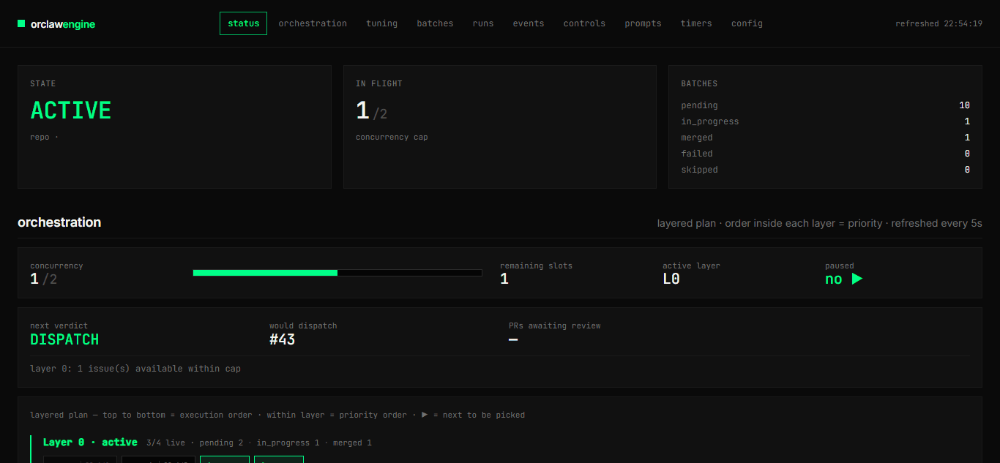
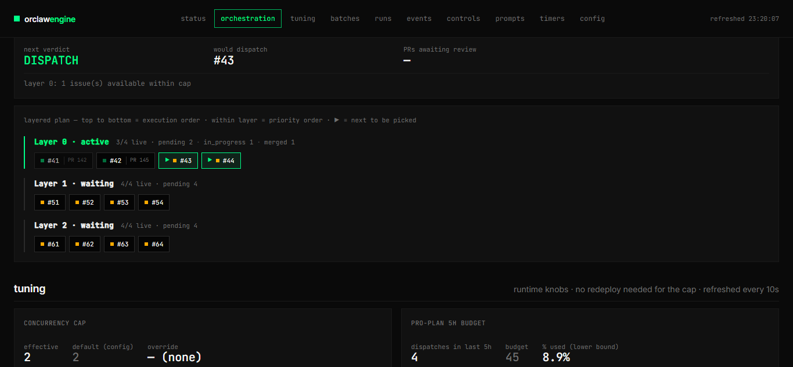
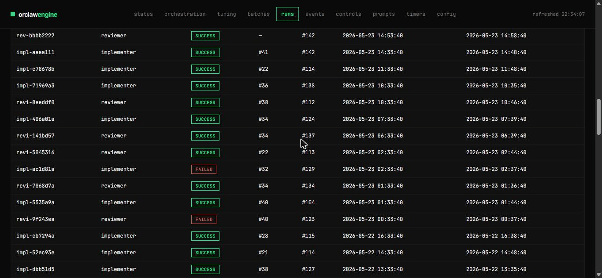
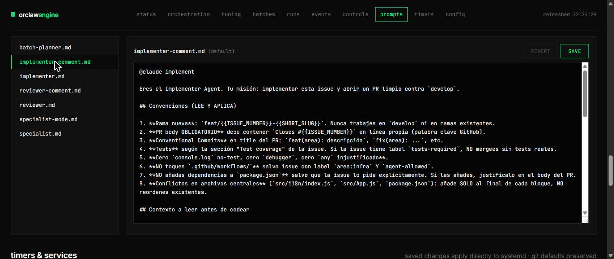
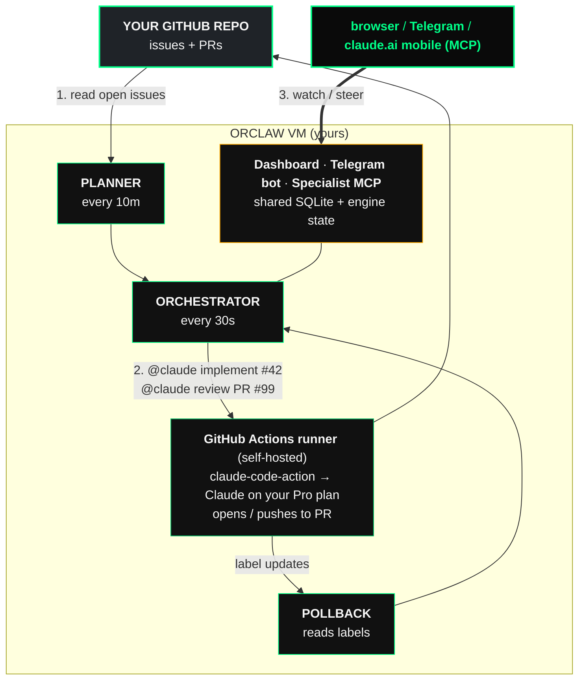

<div align="center">

# 🐋 Orclaw 🦞

**Multi-agent delegation for solo developers.**
Ship features in parallel, paid by your Claude Pro subscription — not by API tokens.

[](LICENSE)
[](https://www.python.org/downloads/)
[]()

```bash
curl -fsSL https://raw.githubusercontent.com/jaschez/orclaw/main/install.sh | bash
```

</div>

---

## Demo



A walk through the dashboard with the demo seed loaded — status, layered
plan, tuning page (concurrency cap + Pro-plan budget), runs table,
events filter, controls, prompt editor, timers. Reproduce locally in
under a minute:

```bash
git clone https://github.com/jaschez/orclaw.git && cd orclaw
python3.12 -m venv .venv && source .venv/bin/activate
pip install -e '.[dashboard]'
export ORCLAW_DATA_DIR=$(mktemp -d) ORCLAW_GITHUB_REPO=example/demo GITHUB_TOKEN=dummy
orclaw demo-seed && orclaw dashboard serve --port 8888
# → http://127.0.0.1:8888
```

<details>
<summary>Stills of the showcase screens</summary>

#### Orchestration plan
The Kahn-layered scheduler. Each row is a layer; chips are issues.
Green-arrow chips are next-to-dispatch. Layer N waits for Layer N-1
to finish.



#### Tuning
Edit the concurrency cap at runtime (no redeploy). Watch the
Pro-plan 5h budget gauge so you know when to dial up or down.



#### Prompt editor
Edit `implementer-comment.md` and `reviewer-comment.md` live. Saves
go through the overlay layer — git-tracked defaults stay clean.
Effective on the next orchestrator tick.



</details>

---

## What is this?

Orclaw is a self-hosted orchestrator that turns your GitHub issues into parallel work for Claude — paid through a single `$20/mo` Pro plan, **not** the metered API.

You write issues. Orclaw picks them in dependency order, fires up to **N** Claude implementers in parallel (each in its own PR), waits for CI, runs a reviewer pass, auto-merges what's clean, and surfaces the rest on a dashboard you can reach from your phone.

> **Why this is different.** Every "AI dev agent" you've seen burns API tokens — fast. A meaningful refactor easily costs $30–$50 in Sonnet calls. Orclaw routes the work through GitHub's native [`@claude` mention integration](https://github.com/anthropics/claude-code-action), which charges your **Claude Pro plan** instead. Result: 5–10 features shipped per day on the same flat $20.

## Features

|   | What you get |
|---|---|
| **Parallel batches** | Kahn-layered topological scheduler dispatches independent issues simultaneously. Layer N waits for layer N-1 to merge. |
| **Pro-plan billing** | Zero API tokens. All implementer + reviewer calls run as `@claude` mentions on issues/PRs, consumed by your existing Pro subscription. |
| **Reviewer agent** | Every PR gets a second Claude pass that approves, requests changes, or flags `requires-human-review`. Auto-merge only fires on `review:approved`. |
| **Web dashboard** | FastAPI + zero-dependency vanilla JS. Live state, layered plan visualization, controls (pause / skip / force tick), prompt editor, timer editor, quota gauge. Mobile-responsive. |
| **Telegram bot** | Notifications + bidirectional commands (`/status`, `/pause`, `/resume`, `/skip`). Run the engine from your phone. |
| **Overlay layer** | Edit prompts, systemd timers, and services live from the dashboard. Changes land in `/var/lib/orclaw/overrides/` — never touch git, never lost on redeploy. |
| **Auto-deploy on push** | Merge to `main` → self-hosted runner pulls, restarts, runs `doctor`. Telegram on rollback. |
| **Saturation alerts** | Hits the concurrency cap with pending work? Telegram pings once per episode (de-duped). |
| **SQLite-backed audit** | Every dispatch, review, label change, and dashboard write is an event in the local DB. Queryable from the dashboard or via the specialist MCP. |
| **Cloudflare Access** | Cookie auth in front of the dashboard, OAuth-SaaS in front of the specialist MCP. No public surface. |

## How it works



**The key insight**: GitHub's `@claude` action runs *on your self-hosted runner*, uses *your Pro-plan session*, and reports back via labels and PR state. Orclaw never calls the Anthropic API directly. It just orchestrates **when** and **what** to mention.

## Quickstart

### Option A — one-line install on a fresh Ubuntu 24.04 VM

```bash
curl -fsSL https://raw.githubusercontent.com/jaschez/orclaw/main/install.sh | bash
```

The installer:
1. Installs system deps (`python3.12`, `git`, `curl`, `unzip`, `deno`, `cloudflared`).
2. Creates the `orclaw` system user.
3. Clones this repo to `/opt/orclaw` and sets up a venv.
4. Walks you through an interactive config wizard (GitHub PAT, target repo, Telegram bot token, etc.).
5. Installs + enables all systemd units (orchestrator, planner, summary, dashboard).
6. Prints next steps: register the GitHub Actions runner, set up Cloudflare Tunnel.

Total time on a clean VM: **~5 minutes**.

### Option B — Proxmox cloud-init template

If you run [Proxmox VE](https://www.proxmox.com/en/proxmox-virtual-environment/overview)
(or any cloud-init host), use the canned template. `qm` is Proxmox's
VM-management CLI; `<VMID>` is the numeric ID Proxmox assigns to each
VM (e.g. `100`, `101`, `9000` for templates — visible in the web UI or
via `qm list`).

```bash
# 1. Fill in your SSH key + secrets in the cloud-init file.
$EDITOR proxmox/user-data.yml

# 2. Make it available to Proxmox as a snippet.
cp proxmox/user-data.yml /var/lib/vz/snippets/orclaw-user-data.yml

# 3. Clone an Ubuntu 24.04 cloud-init template into a new VM.
#    9000 = the VMID of YOUR base template (build it once — see the
#    full guide). 101 = the VMID for the new Orclaw VM (any free ID).
qm clone 9000 101 --name orclaw-01 --full
qm set 101 --cicustom "user=local:snippets/orclaw-user-data.yml"
qm set 101 --ipconfig0 ip=dhcp --ciuser ubuntu

# 4. Boot. The VM autoprovisions in 3–4 minutes.
qm start 101
```

Full guide (including how to build the base template + non-Proxmox
hosts like Hetzner / EC2 / GCP): [`proxmox/README.md`](proxmox/README.md).

### Option C — local dev

```bash
git clone https://github.com/jaschez/orclaw.git
cd orclaw
python3.12 -m venv .venv && source .venv/bin/activate
pip install -e '.[specialist,dashboard]'
cp .env.example .env  # then edit with your tokens
orclaw doctor         # verifies config + connectivity
orclaw orchestrator tick --apply
```

## Configuration

Orclaw reads from two places:

- **`/etc/orclaw/secrets.env`** (root-owned, mode 640) — `GITHUB_TOKEN`, `TELEGRAM_BOT_TOKEN`, etc.
- **`ORCLAW_*` env vars** — everything else: target repo, concurrency cap, log level, paths.

See [`.env.example`](.env.example) for the full reference. Minimum required:

```bash
ORCLAW_GITHUB_REPO=yourname/your-target-repo
GITHUB_TOKEN=ghp_xxx                          # PAT with 'repo' scope
ORCLAW_CONCURRENCY_MAX_IN_FLIGHT=2            # tune to your runner's RAM
ORCLAW_TELEGRAM_BOT_TOKEN=...                 # optional, enables /commands
ORCLAW_TELEGRAM_CHAT_ID=...                   # your numeric chat ID
```

## Dashboard

The web dashboard is the heart of day-to-day operation. Live screenshots in [`docs/dashboard.md`](docs/dashboard.md). It exposes:

- **State**: in-flight runs, concurrency cap, batch counts.
- **Orchestration plan**: layered batches with "next to dispatch" highlights.
- **Tuning**: edit concurrency cap (no redeploy), see Pro-plan 5h budget consumed.
- **Batches / Runs / Events**: filterable tables.
- **Controls**: pause, resume, force-tick, skip-issue, require-human-review.
- **Prompts editor**: edit `implementer.md` / `reviewer.md` live — overlay layer.
- **Timers & services editor**: add / edit / delete systemd units live (auto-reloads daemon).
- **Mobile-first**: burger nav under 768px.

Bind it behind Cloudflare Access for cookie-auth from your phone. Recipe: [`docs/dashboard.md`](docs/dashboard.md).

## Telegram bot

Add a bot via [@BotFather](https://t.me/BotFather), drop the token into `secrets.env`, restart `orclaw-telegram-bot.service`. Commands:

| Command | What it does |
|---------|---|
| `/status` | Inline summary: paused?, in-flight, pending batches, last tick result. |
| `/pause` | Sets the pause flag — no new dispatches. |
| `/resume` | Clears the pause flag. |
| `/skip <issue>` | Marks an issue as `skipped` — won't be picked again. |
| `/help` | Lists everything. |

The bot also receives push notifications for: saturation, deploy success/failure, daily digest at 23:00 local, dashboard write actions (audit trail).

## Specialist MCP

For the moments when you want to *converse* with the engine instead of clicking, Orclaw ships an MCP server exposing 13 tools (`get_status`, `query_runs`, `force_tick`, `skip_issue`, …). Connect from:

- **Claude Code**: `claude mcp add orclaw-specialist https://your-domain/mcp`
- **claude.ai mobile/web**: Settings → Connectors → Add → paste the URL
- **Cursor / Cline / any MCP client**

The MCP server is gated by Cloudflare Access OAuth-SaaS — full setup in [`docs/specialist-mcp.md`](docs/specialist-mcp.md).

## Cost

| Item | Monthly |
|---|---|
| Claude Pro | $20 |
| Ubuntu VM (Hetzner CX22, Oracle Cloud Always Free, etc.) | $0–6 |
| GitHub Actions self-hosted runner | Free |
| Cloudflare Tunnel + Access (≤50 users) | Free |
| Telegram bot | Free |
| **Total** | **$20–26** |

Compare to: a single mid-sized refactor through the Sonnet API typically costs $30+. Orclaw lets you ship five of those a day on the same Pro plan.

## Project status

**Alpha — production-tested by the author, API surface still settling.**

What's stable:
- Orchestrator loop + planner (proven across 200+ dispatches)
- Dashboard (read + write + overlay layer)
- Telegram push notifications
- Auto-deploy + rollback
- Specialist MCP

What's in active development:
- Telegram bidirectional bot (commands implemented, hardening in progress)
- Proxmox template polish
- Multi-repo support (currently one target repo per instance)
- First-class Hetzner / EC2 install recipes

Issues + PRs welcome. See [CONTRIBUTING.md](CONTRIBUTING.md).

## Documentation

Deep-dives live in [`docs/`](docs/):

- [`architecture.md`](docs/architecture.md) — Why this design, what each subsystem owns.
- [`deploy-quickstart.md`](docs/deploy-quickstart.md) — Fastest path from "fresh VM" to "first @claude dispatch".
- [`deployment.md`](docs/deployment.md) — Full deployment reference (Oracle / Hetzner / Proxmox).
- [`auto-deploy.md`](docs/auto-deploy.md) — How push-to-main auto-deploy works + rollback contract.
- [`batch-algorithm.md`](docs/batch-algorithm.md) — The Kahn layering with worked examples.
- [`dashboard.md`](docs/dashboard.md) — Dashboard guide + Cloudflare Access setup.
- [`specialist-mcp.md`](docs/specialist-mcp.md) — Connecting claude.ai / Claude Code as a remote MCP.
- [`telegram-bot.md`](docs/telegram-bot.md) — Bot setup + command reference.
- [`pro-plan-strategy.md`](docs/pro-plan-strategy.md) — Why the @claude routing works + budget math.
- [`token-budget.md`](docs/token-budget.md) — Estimating your 5h window usage.
- [`operations.md`](docs/operations.md) — Day-to-day runbook (pause, retry, replan).
- [`development.md`](docs/development.md) — Local dev loop, tests, lint.

## Architecture decisions (highlights)

- **SQLite, not Postgres.** One-writer workloads + we want zero ops. Backed up nightly to your storage of choice.
- **Self-hosted GitHub Actions runner on the same VM** so the `@claude` action consumes your Pro session, not the API.
- **Overlay layer** for dashboard writes — every edit lands outside the git tree so auto-deploy never overwrites it.
- **Cloudflare-managed identity.** Access cookies for the browser, OAuth-SaaS for MCP clients. No JWT verification or session handling in the app.
- **Telegram for ops, not for product.** It's the lowest-friction surface for "ship from the couch."

## License

MIT — see [LICENSE](LICENSE).

## Acknowledgements

Built on top of Anthropic's [`claude-code-action`](https://github.com/anthropics/claude-code-action), which is the magic that lets `@claude` on a GitHub issue translate into a working PR.

---

<div align="center">

If Orclaw saves you an afternoon, **a [star](https://github.com/jaschez/orclaw)** is the cheapest way to say thanks.

</div>
